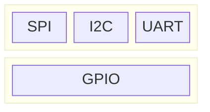

# Hardware
## [Pin](https://en.wikipedia.org/wiki/Lead_(electronics))
Hardware Interface:

Hardware Protocol:

[GPIO](https://en.wikipedia.org/wiki/General-purpose_input/output), [SPI](https://en.wikipedia.org/wiki/Serial_Peripheral_Interface), [I2C](https://en.wikipedia.org/wiki/I%C2%B2C), [UART](https://en.wikipedia.org/wiki/Universal_asynchronous_receiver-transmitter), [1-Wire](https://en.wikipedia.org/wiki/1-Wire)

## USB

Hardware Interface:
USB typeA / typeB / typeC

Hardware Protocol:
USB 1.0 / 2.0 / 3.0