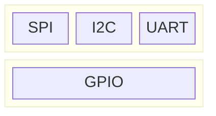

# Hardware
## [Pin](https://en.wikipedia.org/wiki/Lead_(electronics))
Hardware Interface:


Hardware Protocol:

[GPIO](https://en.wikipedia.org/wiki/General-purpose_input/output), [SPI](https://en.wikipedia.org/wiki/Serial_Peripheral_Interface), [I2C](https://en.wikipedia.org/wiki/I%C2%B2C), [UART](https://en.wikipedia.org/wiki/Universal_asynchronous_receiver-transmitter), [1-Wire](https://en.wikipedia.org/wiki/1-Wire)




## USB

Hardware Interface:
USB typeA / typeB / typeC

Hardware Protocol:
USB 1.0 / 2.0 / 3.0

# Software
## API
``` c
// Register device
register_netdevice();

// Register driver
platform_driver_register();
```

# [Platform Devices and Drivers](https://docs.kernel.org/driver-api/driver-model/platform.html)


## Platform devices
**Platform devices** are a device that your embedded system could not detect automatically, typically appear as autonomous entities in the system.

What they usually have in common is direct addressing from a CPU bus. Rarely, a platform_device will be connected through a segment of some other kind of bus; but its registers will still be directly addressable.

Or, in common situations where the device is known not to be hot-pluggable, the probe() routine can live in an init section to reduce the driver’s runtime memory footprint:

## Platform drivers# Hardware
## [Pin](https://en.wikipedia.org/wiki/Lead_(electronics))
Hardware Interface:


Hardware Protocol:

[GPIO](https://en.wikipedia.org/wiki/General-purpose_input/output), [SPI](https://en.wikipedia.org/wiki/Serial_Peripheral_Interface), [I2C](https://en.wikipedia.org/wiki/I%C2%B2C), [UART](https://en.wikipedia.org/wiki/Universal_asynchronous_receiver-transmitter), [1-Wire](https://en.wikipedia.org/wiki/1-Wire)


## USB

Hardware Interface:
USB typeA / typeB / typeC

Hardware Protocol:
USB 1.0 / 2.0 / 3.0

# Software
## API
``` c
// Register device
register_netdevice();

// Register driver
platform_driver_register();
```

# [Platform Devices and Drivers](https://docs.kernel.org/driver-api/driver-model/platform.html)


## Platform devices
**Platform devices** are a device that your embedded system could not detect automatically, typically appear as autonomous entities in the system.

What they usually have in common is direct addressing from a CPU bus. Rarely, a platform_device will be connected through a segment of some other kind of bus; but its registers will still be directly addressable.

Or, in common situations where the device is known not to be hot-pluggable, the probe() routine can live in an init section to reduce the driver’s runtime memory footprint:

## Platform drivers