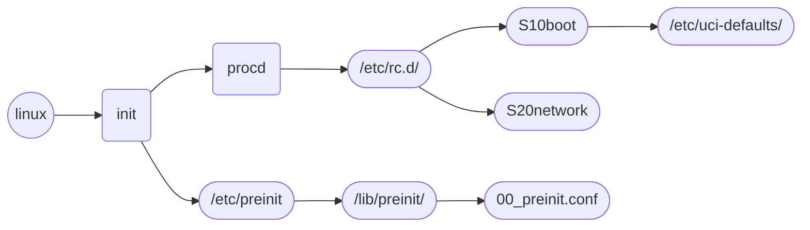

# OpenWrt
###### tags: `OpenWrt`

/etc/init.d/$\lt$config$\gt$ restart
    
factory reset
> umount /overlay ; sleep 1; mtd -r erase rootfs_data
firstboot && reboot now

opkg/ipkg
> opkg install $\lt$pkg$\gt$
opkg list

netifd
> /sbin/netifd -d 15

## procd
### reload_config
if configuration be modified, it will notify porcd to re-read configuration and take effect

### procd init script parameters (Init Scripts)
A procd init script is similiar to an old init script, but with a few differences:
* procd expects services to run in the foreground
* Different shebang line: #!/bin/sh /etc/rc.common
* procd expects that shell variable (not environment variable) initscript is set to the path of the script that invoked it
* Explicitly use procd USE_PROCD=1
```
#!/bin/sh /etc/rc.common

USE_PROCD=1
```

procd_set_param stdout 1
procd_set_param stderr 1

## ubus/ubusd
### shell API
> ubus list
ubus -v list network.wireless
ubus call network reload
ubus list network.interface.*

> ubus list
ubus -v list testbed.girl
ubus call testbed.girl restart
ubus call testbed.girl reload

> ubus call network.interface.iphost_4001 status | jsonfilter -e '@["ipv4-address"][0].address'
ubus call network.interface.iphost_4001 status | jsonfilter -e '@.inactive'
ubus call network.interface.iphost_4001 status | jsonfilter -e '@["inactive"]["route"][0].nexthop'
ubus call network.device status  '{"name":"pon.4001"}'

### C API
> ubus_add_object()
UBUS_OBJECT_TYPE
UBUS_METHOD_NOARG
UBUS_METHOD

> ubus_invoke()

## [The UCI system](https://openwrt.org/docs/guide-user/base-system/uci)

Different presentation
- Human-friendly: as presented in the config files or with the command “uci export <config>”
- Programmable: as presented with the command “uci show <config>”

#### Configuration files
[Configuration example](https://hackmd.io/ya8BeBw2Qgy_YslcLUl-Jg)

#### C API
>uci_set
uci_commit()
uci_unload()
uci_free_context()
uci_lookup_option()
uci_foreach_element()
load_config()
uci_load()
uci_lookup_option_string()

uci_lookup_ptr()
```
    struct uci_ptr ptr = {
        .package = "wireless",
        .section = name,
        .flags = (name && *name == '@') ? UCI_LOOKUP_EXTENDED : 0,
    };
    const char *opt;

    if (!uci_ctx) {
        uci_ctx = uci_alloc_context();
        if (!uci_ctx)
            return NULL;
    }

    if (uci_lookup_ptr(uci_ctx, &ptr, NULL, true))
        return NULL;

    if (!ptr.s || strcmp(ptr.s->type, "wifi-device") != 0)
        return NULL;

    opt = uci_lookup_option_string(uci_ctx, ptr.s, "type");
    if (!opt || strcmp(opt, type) != 0)
        return NULL;

    return ptr.s;

```
    
    

#### shell
uci get prplmesh.config.enable
uci show $\lt$SUBSYSTEM_NAME$\gt$
uci export $\lt$SUBSYSTEM_NAME$\gt$

uci validate
> find corrupted configs

uci changes
> Showing the not-yet-saved modified values

uci set network.lan.ipaddr=192.168.2.2
uci commit $\lt$config$\gt$

uci set wireless.wifinet1.disabled=0
> change wireless confiuration

uci commit wireless
> save wireless configuration

/sbin/wifi down
/sbin/wifi up
> issue wireless new setting

### LuCI WebUI


### shell scripts
> json_add_object
> json_add_array

### wireless
>/lib/netifd/wireless/mac80211.sh
/lib/wifi/mac80211.sh

call init_wireless_driver() to add default wireless configuration
    
### ucitrack
    
    
## [UCI defaults](https://openwrt.org/docs/guide-developer/uci-defaults)
OpenWrt relies on UCI, the Unified Configuration Interface, to configure its core services. UCI defaults provides a way to preconfigure your images, using UCI.

To set some system defaults the first time the device boots, create a script in the directory `/etc/uci-defaults`.

All scripts in that directory are automatically executed by the `boot` service:

* If they exit with code 0 they are deleted afterwards.
* Scripts that exit with non-zero exit code are not deleted and will be re-executed at the next boot until they also successfully exit.
In a live router you can see the existing UCI defaults scripts in `/rom/etc/uci-defaults`, as `/etc/uci-defaults` itself is typically empty (after all scripts have been run successfully and have been deleted).

UCI defaults scripts can be created by packages or they can be inserted into the build manually as custom files.
    
## The boot process
    

    
## shell
> network_get_dnsserver
procd_set_param stdout 1
procd_set_param stderr 1# OpenWrt
###### tags: `OpenWrt`

/etc/init.d/$\lt$config$\gt$ restart
    
factory reset
> umount /overlay ; sleep 1; mtd -r erase rootfs_data
firstboot && reboot now

opkg/ipkg
> opkg install $\lt$pkg$\gt$
opkg list

netifd
> /sbin/netifd -d 15

## procd
### reload_config
if configuration be modified, it will notify porcd to re-read configuration and take effect

### procd init script parameters (Init Scripts)
A procd init script is similiar to an old init script, but with a few differences:
* procd expects services to run in the foreground
* Different shebang line: #!/bin/sh /etc/rc.common
* procd expects that shell variable (not environment variable) initscript is set to the path of the script that invoked it
* Explicitly use procd USE_PROCD=1
```
#!/bin/sh /etc/rc.common

USE_PROCD=1
```

procd_set_param stdout 1
procd_set_param stderr 1

## ubus/ubusd
### shell API
> ubus list
ubus -v list network.wireless
ubus call network reload
ubus list network.interface.*

> ubus list
ubus -v list testbed.girl
ubus call testbed.girl restart
ubus call testbed.girl reload

> ubus call network.interface.iphost_4001 status | jsonfilter -e '@["ipv4-address"][0].address'
ubus call network.interface.iphost_4001 status | jsonfilter -e '@.inactive'
ubus call network.interface.iphost_4001 status | jsonfilter -e '@["inactive"]["route"][0].nexthop'
ubus call network.device status  '{"name":"pon.4001"}'

### C API
> ubus_add_object()
UBUS_OBJECT_TYPE
UBUS_METHOD_NOARG
UBUS_METHOD

> ubus_invoke()

## [The UCI system](https://openwrt.org/docs/guide-user/base-system/uci)

Different presentation
- Human-friendly: as presented in the config files or with the command “uci export <config>”
- Programmable: as presented with the command “uci show <config>”

#### Configuration files
[Configuration example](https://hackmd.io/ya8BeBw2Qgy_YslcLUl-Jg)

#### C API
>uci_set
uci_commit()
uci_unload()
uci_free_context()
uci_lookup_option()
uci_foreach_element()
load_config()
uci_load()
uci_lookup_option_string()

uci_lookup_ptr()
```
    struct uci_ptr ptr = {
        .package = "wireless",
        .section = name,
        .flags = (name && *name == '@') ? UCI_LOOKUP_EXTENDED : 0,
    };
    const char *opt;

    if (!uci_ctx) {
        uci_ctx = uci_alloc_context();
        if (!uci_ctx)
            return NULL;
    }

    if (uci_lookup_ptr(uci_ctx, &ptr, NULL, true))
        return NULL;

    if (!ptr.s || strcmp(ptr.s->type, "wifi-device") != 0)
        return NULL;

    opt = uci_lookup_option_string(uci_ctx, ptr.s, "type");
    if (!opt || strcmp(opt, type) != 0)
        return NULL;

    return ptr.s;

```
    
    

#### shell
uci get prplmesh.config.enable
uci show $\lt$SUBSYSTEM_NAME$\gt$
uci export $\lt$SUBSYSTEM_NAME$\gt$

uci validate
> find corrupted configs

uci changes
> Showing the not-yet-saved modified values

uci set network.lan.ipaddr=192.168.2.2
uci commit $\lt$config$\gt$

uci set wireless.wifinet1.disabled=0
> change wireless confiuration

uci commit wireless
> save wireless configuration

/sbin/wifi down
/sbin/wifi up
> issue wireless new setting

### LuCI WebUI


### shell scripts
> json_add_object
> json_add_array

### wireless
>/lib/netifd/wireless/mac80211.sh
/lib/wifi/mac80211.sh

call init_wireless_driver() to add default wireless configuration
    
### ucitrack
    
    
## [UCI defaults](https://openwrt.org/docs/guide-developer/uci-defaults)
OpenWrt relies on UCI, the Unified Configuration Interface, to configure its core services. UCI defaults provides a way to preconfigure your images, using UCI.

To set some system defaults the first time the device boots, create a script in the directory `/etc/uci-defaults`.

All scripts in that directory are automatically executed by the `boot` service:

* If they exit with code 0 they are deleted afterwards.
* Scripts that exit with non-zero exit code are not deleted and will be re-executed at the next boot until they also successfully exit.
In a live router you can see the existing UCI defaults scripts in `/rom/etc/uci-defaults`, as `/etc/uci-defaults` itself is typically empty (after all scripts have been run successfully and have been deleted).

UCI defaults scripts can be created by packages or they can be inserted into the build manually as custom files.
    
## The boot process
    

    
## shell
> network_get_dnsserver
procd_set_param stdout 1
procd_set_param stderr 1