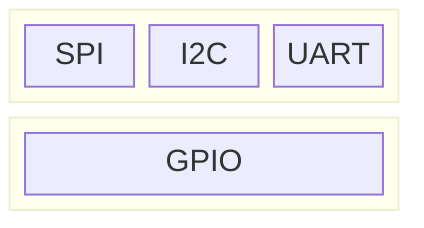

# [Pin](https://en.wikipedia.org/wiki/Lead_(electronics))


## Protocol

[GPIO](https://en.wikipedia.org/wiki/General-purpose_input/output), [SPI](https://en.wikipedia.org/wiki/Serial_Peripheral_Interface), [I2C](https://en.wikipedia.org/wiki/I%C2%B2C), [UART](https://en.wikipedia.org/wiki/Universal_asynchronous_receiver-transmitter), [1-Wire](https://en.wikipedia.org/wiki/1-Wire)




## Pinout (40-pin J8 Header)


[Pin Numbering - Raspberry Pi 4B](https://www.pi4j.com/1.4/pins/rpi-4b.html)
[Raspberry-Pi Pinout](https://pinout.xyz/)

# Relpace firmware with u-boot + OpenWrt
* u-boot


``` console
U-Boot> setenv bootargs 8250.nr_uarts=1 console=ttyS0,115200 root=/dev/mmcblk0p2 rootwait rw
U-Boot> setenv bootcmd 'fatload mmc 0:1 $kernel_addr_r Image; booti $kernel_addr_r - $fdt_addr'
U-Boot> saveenv
```
[man page](https://hub.digi.com/dp/path=/support/asset/u-boot-reference-manual/)


mmcblk0p2
* mmc: 代表MultiMediaCard，一種儲存技術。
* blk: 是"block"（區塊）的縮寫，表示這是一個區塊裝置。
* 0: 表示儲存裝置的編號，mmcblk0 指的是第一個MMC 儲存裝置。
* p1: 表示該儲存裝置上的第一個分割區。


# Porting Temperature Sensor, DS18B20
the procedure:
1. Configure GPIO PIN action as 1-Wire protocol
2. Add DS18B20 into Device Tree
3. Probe Device


## Configure GPIO PIN to Support the Protocol
Enable 1-Wire interface in `/boot/config.txt`
``` vim
# gpio pin is 4 in default.
dtoverlay=w1-gpio,gpiopin=21
```
When CPU bootup, Bootloader will read this configuration file and configure GPIO PIN 21 as 1-Wire interface.


## Add DS18B20 into Device Tree

[devicetree-specification](https://github.com/devicetree-org/devicetree-specification)
dts, dtb, dto

``` console
$ cd /proc/device-tree/
$ cd /sys/firmware/devicetree/base
$ dtc -O dtb -o p4080ds.dtb p4080ds.dts
$ dtc -I dtb -O dts p4080ds.dtb
$ dtc -I dtb -O dts -o <output_filename.dts> <input_filename.dtbo>
$ cd /sys/bus/w1/devices/28-00000xxxxxxx/
```

## Probe Device


# Reference
[Day 8：Device Tree (Part 1)](https://ithelp.ithome.com.tw/m/articles/10242811)


# [Pin](https://en.wikipedia.org/wiki/Lead_(electronics))


## Protocol

[GPIO](https://en.wikipedia.org/wiki/General-purpose_input/output), [SPI](https://en.wikipedia.org/wiki/Serial_Peripheral_Interface), [I2C](https://en.wikipedia.org/wiki/I%C2%B2C), [UART](https://en.wikipedia.org/wiki/Universal_asynchronous_receiver-transmitter), [1-Wire](https://en.wikipedia.org/wiki/1-Wire)


## Pinout (40-pin J8 Header)


[Pin Numbering - Raspberry Pi 4B](https://www.pi4j.com/1.4/pins/rpi-4b.html)
[Raspberry-Pi Pinout](https://pinout.xyz/)

# Relpace firmware with u-boot + OpenWrt
* u-boot


``` console
U-Boot> setenv bootargs 8250.nr_uarts=1 console=ttyS0,115200 root=/dev/mmcblk0p2 rootwait rw
U-Boot> setenv bootcmd 'fatload mmc 0:1 $kernel_addr_r Image; booti $kernel_addr_r - $fdt_addr'
U-Boot> saveenv
```
[man page](https://hub.digi.com/dp/path=/support/asset/u-boot-reference-manual/)


mmcblk0p2
* mmc: 代表MultiMediaCard，一種儲存技術。
* blk: 是"block"（區塊）的縮寫，表示這是一個區塊裝置。
* 0: 表示儲存裝置的編號，mmcblk0 指的是第一個MMC 儲存裝置。
* p1: 表示該儲存裝置上的第一個分割區。


# Porting Temperature Sensor, DS18B20
the procedure:
1. Configure GPIO PIN action as 1-Wire protocol
2. Add DS18B20 into Device Tree
3. Probe Device


## Configure GPIO PIN to Support the Protocol
Enable 1-Wire interface in `/boot/config.txt`
``` vim
# gpio pin is 4 in default.
dtoverlay=w1-gpio,gpiopin=21
```
When CPU bootup, Bootloader will read this configuration file and configure GPIO PIN 21 as 1-Wire interface.


## Add DS18B20 into Device Tree

[devicetree-specification](https://github.com/devicetree-org/devicetree-specification)
dts, dtb, dto

``` console
$ cd /proc/device-tree/
$ cd /sys/firmware/devicetree/base
$ dtc -O dtb -o p4080ds.dtb p4080ds.dts
$ dtc -I dtb -O dts p4080ds.dtb
$ dtc -I dtb -O dts -o <output_filename.dts> <input_filename.dtbo>
$ cd /sys/bus/w1/devices/28-00000xxxxxxx/
```

## Probe Device


# Reference
[Day 8：Device Tree (Part 1)](https://ithelp.ithome.com.tw/m/articles/10242811)


