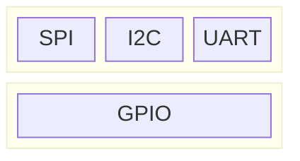

# [Pin](https://en.wikipedia.org/wiki/Lead_(electronics))

## Protocol

[GPIO](https://en.wikipedia.org/wiki/General-purpose_input/output), [SPI](https://en.wikipedia.org/wiki/Serial_Peripheral_Interface), [I2C](https://en.wikipedia.org/wiki/I%C2%B2C), [UART](https://en.wikipedia.org/wiki/Universal_asynchronous_receiver-transmitter), [1-Wire](https://en.wikipedia.org/wiki/1-Wire)

## Pinout (40-pin J8 Header)

[Pin Numbering - Raspberry Pi 4B](https://www.pi4j.com/1.4/pins/rpi-4b.html)
[Raspberry-Pi Pinout](https://pinout.xyz/)# [Pin](https://en.wikipedia.org/wiki/Lead_(electronics))

## Protocol

[GPIO](https://en.wikipedia.org/wiki/General-purpose_input/output), [SPI](https://en.wikipedia.org/wiki/Serial_Peripheral_Interface), [I2C](https://en.wikipedia.org/wiki/I%C2%B2C), [UART](https://en.wikipedia.org/wiki/Universal_asynchronous_receiver-transmitter), [1-Wire](https://en.wikipedia.org/wiki/1-Wire)

## Pinout (40-pin J8 Header)

[Pin Numbering - Raspberry Pi 4B](https://www.pi4j.com/1.4/pins/rpi-4b.html)
[Raspberry-Pi Pinout](https://pinout.xyz/)