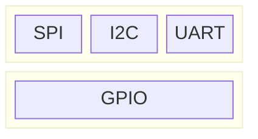

``` console
$ mount -t configfs none /sys/kernel/config
$ dtoverlay /boot/overlays/w1-gpio.dtbo
```

# [Datasheet](https://datasheets.raspberrypi.com/rpi4/raspberry-pi-4-datasheet.pdf)

[bcm2711-peripherals](https://datasheets.raspberrypi.com/bcm2711/bcm2711-peripherals.pdf)

# [Pin](https://en.wikipedia.org/wiki/Lead_(electronics))


## Pinout (40-pin J8 Header)
[Raspberry Pi Pinout Guide](https://randomnerdtutorials.com/raspberry-pi-pinout-gpios/)

## Protocol

[GPIO](https://en.wikipedia.org/wiki/General-purpose_input/output), [SPI](https://en.wikipedia.org/wiki/Serial_Peripheral_Interface), [I2C](https://en.wikipedia.org/wiki/I%C2%B2C), [UART](https://en.wikipedia.org/wiki/Universal_asynchronous_receiver-transmitter), [1-Wire](https://en.wikipedia.org/wiki/1-Wire)




# Relpace firmware with u-boot + OpenWrt
[Raspberry pi 4 Build System (64bits)](https://hackmd.io/@sss22213/rklpt-BGK)


* u-boot


``` console
U-Boot> setenv bootargs 8250.nr_uarts=1 console=ttyS0,115200 root=/dev/mmcblk0p2 rootwait rw
U-Boot> setenv bootcmd 'fatload mmc 0:1 $kernel_addr_r Image; booti $kernel_addr_r - $fdt_addr'
U-Boot> saveenv
```
[man page](https://hub.digi.com/dp/path=/support/asset/u-boot-reference-manual/)

mmcblk0p2
* mmc: 代表MultiMediaCard，一種儲存技術。
* blk: 是"block"（區塊）的縮寫，表示這是一個區塊裝置。
* 0: 表示儲存裝置的編號，mmcblk0 指的是第一個MMC 儲存裝置。
* p1: 表示該儲存裝置上的第一個分割區。


# Porting Temperature Sensor, DS18B20
The procedure:
1. Changing GPIO PIN functionalities with Device Tree
2. Probe Device


## Changing GPIO PIN functionalities
`Pin Multiplexing`. These pins have a default function and may have other functionalities (ALT0, ALT1, ALT2, ALT3, etc.). In Linux, modifying the default function of the pin multiplexing configuration, it is necessary to alter the [Devicetree](https://en.wikipedia.org/wiki/Devicetree).

``` console
$ mount -t configfs none /sys/kernel/config

# Apply dtbo
$ dtoverlay /boot/overlays/w1-gpio.dtbo

# If it applies successfully, it will create a corresponding directory under the directory, /sys/kernel/config/device-tree/overlays.
$ cd /sys/kernel/config/device-tree/overlays/0_w1-gpio
$ cat status 
applied
$
```


[devicetree-specification](https://github.com/devicetree-org/devicetree-specification)
dts, dtb, dtbo

``` console
$ cd /proc/device-tree/
$ cd /sys/firmware/devicetree/base
$ dtc -O dtb -o p4080ds.dtb p4080ds.dts
$ dtc -I dtb -O dts p4080ds.dtb
$ dtc -I dtb -O dts -o <output_filename.dts> <input_filename.dtbo>
$ cd /sys/bus/w1/devices/28-00000xxxxxxx/
$ mount -t configfs none /sys/kernel/config
$ dtoverlay /boot/overlays/w1-gpio.dtb
```

## Probe Device


# Reference
[Day 8：Device Tree (Part 1)](https://ithelp.ithome.com.tw/m/articles/10242811)


``` console
$ mount -t configfs none /sys/kernel/config
$ dtoverlay /boot/overlays/w1-gpio.dtbo
```

# [Datasheet](https://datasheets.raspberrypi.com/rpi4/raspberry-pi-4-datasheet.pdf)

[bcm2711-peripherals](https://datasheets.raspberrypi.com/bcm2711/bcm2711-peripherals.pdf)

# [Pin](https://en.wikipedia.org/wiki/Lead_(electronics))


## Pinout (40-pin J8 Header)
[Raspberry Pi Pinout Guide](https://randomnerdtutorials.com/raspberry-pi-pinout-gpios/)

## Protocol

[GPIO](https://en.wikipedia.org/wiki/General-purpose_input/output), [SPI](https://en.wikipedia.org/wiki/Serial_Peripheral_Interface), [I2C](https://en.wikipedia.org/wiki/I%C2%B2C), [UART](https://en.wikipedia.org/wiki/Universal_asynchronous_receiver-transmitter), [1-Wire](https://en.wikipedia.org/wiki/1-Wire)


# Relpace firmware with u-boot + OpenWrt
[Raspberry pi 4 Build System (64bits)](https://hackmd.io/@sss22213/rklpt-BGK)


* u-boot


``` console
U-Boot> setenv bootargs 8250.nr_uarts=1 console=ttyS0,115200 root=/dev/mmcblk0p2 rootwait rw
U-Boot> setenv bootcmd 'fatload mmc 0:1 $kernel_addr_r Image; booti $kernel_addr_r - $fdt_addr'
U-Boot> saveenv
```
[man page](https://hub.digi.com/dp/path=/support/asset/u-boot-reference-manual/)

mmcblk0p2
* mmc: 代表MultiMediaCard，一種儲存技術。
* blk: 是"block"（區塊）的縮寫，表示這是一個區塊裝置。
* 0: 表示儲存裝置的編號，mmcblk0 指的是第一個MMC 儲存裝置。
* p1: 表示該儲存裝置上的第一個分割區。


# Porting Temperature Sensor, DS18B20
The procedure:
1. Changing GPIO PIN functionalities with Device Tree
2. Probe Device


## Changing GPIO PIN functionalities
`Pin Multiplexing`. These pins have a default function and may have other functionalities (ALT0, ALT1, ALT2, ALT3, etc.). In Linux, modifying the default function of the pin multiplexing configuration, it is necessary to alter the [Devicetree](https://en.wikipedia.org/wiki/Devicetree).

``` console
$ mount -t configfs none /sys/kernel/config

# Apply dtbo
$ dtoverlay /boot/overlays/w1-gpio.dtbo

# If it applies successfully, it will create a corresponding directory under the directory, /sys/kernel/config/device-tree/overlays.
$ cd /sys/kernel/config/device-tree/overlays/0_w1-gpio
$ cat status 
applied
$
```


[devicetree-specification](https://github.com/devicetree-org/devicetree-specification)
dts, dtb, dtbo

``` console
$ cd /proc/device-tree/
$ cd /sys/firmware/devicetree/base
$ dtc -O dtb -o p4080ds.dtb p4080ds.dts
$ dtc -I dtb -O dts p4080ds.dtb
$ dtc -I dtb -O dts -o <output_filename.dts> <input_filename.dtbo>
$ cd /sys/bus/w1/devices/28-00000xxxxxxx/
$ mount -t configfs none /sys/kernel/config
$ dtoverlay /boot/overlays/w1-gpio.dtb
```

## Probe Device


# Reference
[Day 8：Device Tree (Part 1)](https://ithelp.ithome.com.tw/m/articles/10242811)


